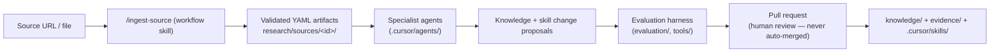

# EssenceOfVirality

An intelligent, self-improving TikTok video-production pipeline for Spotify house-music mixes —
currently in **Phase 1: intelligence infrastructure**.

## What this is

The long-term product: give the system a 10–40 second raw screen recording of a Spotify mix, and it
returns a polished, post-ready portrait TikTok video whose creative, editorial and technical
decisions are selected using accumulated evidence — optimising for views, followers, shares,
comments and likes, in that order.

This repository is currently **only the foundation** for that system:

- a research-ingestion workflow that turns pasted sources (URLs, transcripts, PDFs, CSVs) into
  structured, epistemically honest evidence;
- a team of specialist Cursor agents that extract, assess, contradict-check and synthesise
  findings;
- a knowledge base that keeps the *TikTok distribution model* separate from *controllable
  production rules*, and general virality knowledge separate from Spotify-mix-niche knowledge;
- two skill banks with an authoring standard, maturity lifecycle, critic, and evaluation harness;
- a PR-gated change workflow — research never mutates knowledge or skills directly.

## What this is not (yet)

No video editing, no TikTok posting or account control, no scraping, no analytics warehouse, no
machine-learning model, and no guaranteed virality — the TikTok algorithm is not public and this
project does not pretend to have reverse-engineered it. See `CONTEXT.md` and
`docs/roadmap/` for phase boundaries.

## How it fits together



- **OpenMontage** ([AGPL-3.0](docs/adr/0001-openmontage-integration-strategy.md)) is the candidate
  execution engine for the *future* production pipeline (phase 3+). It stays outside this
  repository as a pinned external clone; our extension sources will live in
  `integrations/openmontage/`. Nothing runs in phase one.
- **Skills**: project-authored skills live in `.cursor/skills/<bank>/` (general-virality,
  spotify-mix-content, research-workflows, meta, experimental); third-party operational skills are
  installed to `.agents/skills/` and pinned via `skills-lock.json`.
- **Evidence discipline**: every claim carries a type (fact / finding / hypothesis / heuristic /
  pattern / anecdote / constraint / preference / experiment result), evidence basis, confidence and
  status. Contradictions are preserved, never silently resolved.

## Getting started

Prerequisites: Python 3.12+, Node 22+ (for the `skills` CLI), git.

```bash
pip install -r tools/requirements.txt
python tools/validate_artifacts.py   # validate all YAML artifacts against schemas/
python tools/lint_skills.py          # lint project skills
python tools/check_ids.py            # ID uniqueness + reference integrity
python tools/run_fixtures.py         # structural fixture checks
```

First workflow: open this repo in Cursor and invoke `/ingest-source <url-or-path>`. The workflow
registers the source, runs extraction and the specialist analysis chain, proposes changes, runs
evaluations, and prepares a PR-ready report. It stops before merge — always.

## Repository map

| Area | Purpose |
|---|---|
| `.cursor/` | Rules, specialist agents, project skill banks |
| `schemas/` | Canonical JSON Schemas for all inter-agent artifacts |
| `research/` | Per-source working artifacts (audit trail) |
| `evidence/` | Promoted claims, hypotheses, contradictions, experiments |
| `knowledge/` | Canonical curated documents (the current working model) |
| `evaluation/` | Rubrics, fixtures, regression records, reports |
| `pipelines/` | Workflow manifests read by the orchestrator |
| `analytics/` | Scaffold for phase-5 analytics learning |
| `integrations/openmontage/` | Pinned ref + future extension sources |
| `tools/`, `tests/` | Deterministic validators and their tests |
| `docs/` | Architecture, ADRs, investigations, workflows, roadmap, guides |

## Current limitations

- Knowledge base contains only the vertical-slice seed content; knowledge acquisition is phase 2.
- Source connectors: web pages, plain text/Markdown, pasted transcripts, PDFs and CSVs; other
  types are registered but routed to manual extraction.
- Behavioural fixture evaluation is agent-run, not CI-run; CI is deterministic only.
- Analytics and production manifests are scaffolds; no importers or renderers exist.

Roadmap: `docs/roadmap/`. Phase-one completion review: `docs/phase-one-review.md`.
