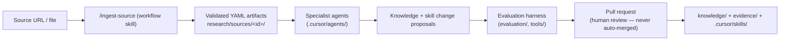

# EssenceOfVirality

An intelligent, self-improving TikTok video-production pipeline for Spotify house-music mixes.

## What this is

Give the system a screen recording of a Spotify mix and it returns a post-ready portrait TikTok
video, a posting package and a quality report — optimising for views, followers, shares, comments
and likes, in that order.

```bash
./process-job new job-003 --recording ~/mix.mp4
./process-job jobs/incoming/job-003
```

Start with [`docs/guides/setup.md`](docs/guides/setup.md), or
[`docs/guides/phone-workflow.md`](docs/guides/phone-workflow.md) if you drive this from a phone.

The repository has two halves that meet in the middle.

**The production pipeline** (`production/`) turns a recording into a video: it validates and
measures the capture, finds the transition, chooses a format family, renders through a single
ffmpeg graph, runs 25 deterministic quality checks, and writes the copy needed to post. Feedback in
plain language re-renders it and proposes lasting preferences, which take effect only once approved.

**The intelligence infrastructure** decides what the pipeline should do:

- a research-ingestion workflow that turns pasted sources (URLs, transcripts, PDFs, CSVs) into
  structured, epistemically honest evidence;
- a team of specialist Cursor agents that extract, assess, contradict-check and synthesise
  findings;
- a knowledge base that keeps the *TikTok distribution model* separate from *controllable
  production rules*, and general virality knowledge separate from Spotify-mix-niche knowledge;
- two skill banks with an authoring standard, maturity lifecycle, critic, and evaluation harness;
- a PR-gated change workflow — research never mutates knowledge or skills directly.

## What this is not

No TikTok posting or account control, no scraping, no analytics warehouse, no machine-learning
model, and no guaranteed virality — the TikTok algorithm is not public and this project does not
pretend to have reverse-engineered it. Posting is manual. AI clips are supplied by the creator; the
pipeline writes Higgsfield prompts but calls nothing. See `CONTEXT.md` and `docs/roadmap/` for
phase boundaries.

## How it fits together



- **OpenMontage** ([AGPL-3.0](docs/adr/0001-openmontage-integration-strategy.md)) supplies probing,
  reframing, trimming and encoding. It stays outside this repository as a pinned external clone
  (`integrations/openmontage/`), and every capability has an ffmpeg fallback, so the pipeline runs
  with or without it.
- **Skills**: project-authored skills live in `.cursor/skills/<bank>/` (general-virality,
  spotify-mix-content, research-workflows, meta, experimental); third-party operational skills are
  installed to `.agents/skills/` and pinned via `skills-lock.json`.
- **Evidence discipline**: every claim carries a type (fact / finding / hypothesis / heuristic /
  pattern / anecdote / constraint / preference / experiment result), evidence basis, confidence and
  status. Contradictions are preserved, never silently resolved.

## Getting started

Prerequisites: Python 3.10+, `ffmpeg`, git. Node 22+ only for the `skills` CLI.

```bash
pip install -r tools/requirements.txt
./process-job status                 # confirm ffmpeg and capability backends
```

To make a video, see [`docs/guides/new-job.md`](docs/guides/new-job.md). To ingest research, open
this repo in Cursor and invoke `/ingest-source <url-or-path>`: the workflow registers the source,
runs extraction and the specialist analysis chain, proposes changes, runs evaluations, and prepares
a PR-ready report. It stops before merge — always.

Before opening a pull request:

```bash
python tools/validate_artifacts.py   # validate all YAML artifacts against schemas/
python tools/lint_skills.py          # lint project skills
python tools/check_ids.py            # ID uniqueness + reference integrity
python tools/run_fixtures.py         # structural fixture checks
```

## Guides

| Guide | For |
| --- | --- |
| [Setup](docs/guides/setup.md) | installing and verifying the pipeline |
| [Phone workflow](docs/guides/phone-workflow.md) | the cloud-agent loop, and how renders get to a phone |
| [New job](docs/guides/new-job.md) | job folders, `job.yaml`, running, what you get back |
| [Feedback](docs/guides/feedback.md) | revisions, and how preferences become permanent |
| [Skill updates](docs/guides/skill-updates.md) | changing behaviour at the right layer |
| [Troubleshooting](docs/guides/troubleshooting.md) | symptoms and fixes |
| [Architecture](docs/architecture/production-pipeline.md) | why the pipeline is shaped this way |

## Repository map

| Area | Purpose |
|---|---|
| `production/` | The production pipeline: stages, config, format templates, CLI |
| `jobs/`, `outputs/` | Working state — the creator's media in, renders out (not in git) |
| `feedback/`, `preferences/`, `experiments/` | What the system has learned, reviewable in a diff |
| `.cursor/` | Rules, specialist agents, project skill banks |
| `schemas/` | Canonical JSON Schemas for all inter-agent artifacts |
| `research/` | Per-source working artifacts (audit trail) |
| `evidence/` | Promoted claims, hypotheses, contradictions, experiments |
| `knowledge/` | Canonical curated documents (the current working model) |
| `evaluation/` | Rubrics, fixtures, regression records, reports |
| `pipelines/` | Workflow manifests read by the orchestrator |
| `analytics/` | Scaffold for phase-5 analytics learning |
| `integrations/openmontage/` | Pinned ref + future extension sources |
| `tools/`, `tests/` | Deterministic validators and their tests |
| `docs/` | Architecture, ADRs, investigations, workflows, roadmap, guides |

## Current limitations

- The transition detector and crop profiles are validated against a synthetic capture only; both
  need confirming against real recordings.
- Feedback interpretation is rule-based. It reports what it could not read rather than guessing,
  but its vocabulary is finite ([feedback guide](docs/guides/feedback.md)).
- Research notes are added by hand; no automated retrieval.
- Knowledge base contains only the vertical-slice seed content; knowledge acquisition is phase 2.
- Source connectors: web pages, plain text/Markdown, pasted transcripts, PDFs and CSVs; other
  types are registered but routed to manual extraction.
- Behavioural fixture evaluation is agent-run, not CI-run; CI is deterministic only.

Roadmap: `docs/roadmap/`. Phase-one completion review: `docs/phase-one-review.md`.
