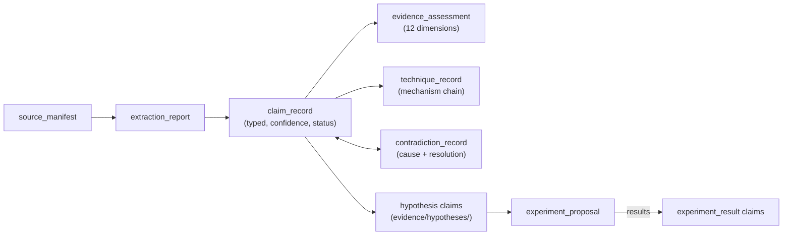

# Evidence Model

Revision date: 2026-08-03. Decisions: ADR 0003 (storage), ADR 0004 (schemas). Taxonomy:
`CONTEXT.md`.

## Structure

## The claim record is the atom

Everything the project believes is a `claim_record` with: an epistemic `claim_type` (nine
values), `evidence_basis` (seven values incl. `creator_statement` for preferences),
`transferability` to the niche, `confidence` (low/medium/high — never percentages),
`status` (active/disputed/superseded/rejected/testing), `platform_dependent`, publication date,
limitations and contradiction links. Knowledge documents cite claims; skills cite claims via
`evidence_refs`; nothing asserts without a citation chain back to a source.

## Change semantics

| Change | Mechanism |
|---|---|
| New belief | New record via PR |
| Substantive revision | New record + `supersedes`/`superseded_by` links |
| Disagreement | `contradiction_record` + `status: disputed` on both sides |
| Rejection | `status: rejected` + reason in limitations/notes; file stays |
| Time passing | Nothing — no time decay; `platform_dependent: true` marks revalidation candidates |

## Assessment dimensions

Relevance, specificity, transparency, method quality, sample size, representativeness, metric
quality, replicability, incentive bias, niche transferability, agreement with first-party data,
agreement with other sources — each rated weak/moderate/strong/unknown/not_applicable with a
note (`schemas/evidence-assessment.schema.json`). Informal sources are assessed, not rejected:
the repository must know *what kind* of evidence each belief rests on, not demand academic
standards of a creator case study.

## Integrity enforcement

CI: `validate_artifacts.py` (schema validity), `check_ids.py` (unique IDs, no dangling
references). Review: the PR gate (ADR 0006). Honesty: the evaluation report's
`cannot_validate_without_real_data` and the standing `knowledge/algorithm-model/unknowns.md`.
