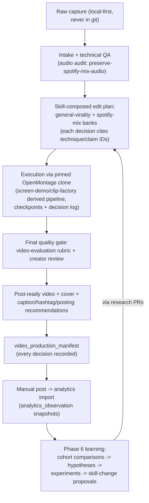

# Future Video Pipeline

Revision date: 2026-08-03. **Design intent for phases 4–6 — nothing here is implemented, and
phases 2–3 must complete first (ADR 0008).** Kept so current decisions stay compatible with the
destination.

## Target experience (the black box)

Creator supplies a 10–40 s raw Spotify screen recording (+ optional instructions/metadata) →
system returns a post-ready 1080×1920 TikTok video plus publishing recommendations → creator
posts manually → analytics flow back and improve the system.

## Planned flow

## Design commitments already made

- Edit plans are **skill-composed and evidence-cited**: every editing decision carries
  `technique_ids`, making the manifest the lineage anchor (ADR 0007).
- Execution is OpenMontage-first (ADR 0001); we own judgement, it owns rendering.
- The creator's final review is a permanent stage — automation reduces effort, not authority.
- Posting stays manual; no account automation without explicit future approval (`SECURITY.md`).
- Artifact storage: raw captures and renders live outside git (local disk now; object storage if
  needed later), referenced by path from manifests.

## Openly unresolved (to be decided in phase 4, not before)

Materialise-script mechanics; checkpoint policy for a low-friction personal pipeline
(`guided` vs `auto_noncreative`); whether clip-factory's batch model fits a one-clip workflow
better than screen-demo; cover-frame generation approach; caption/hashtag recommendation source.
