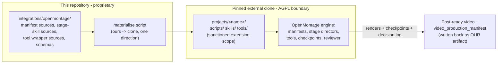

# OpenMontage Integration

Revision date: 2026-08-03. Decision: ADR 0001 (Option D, adapter + extension package, with the
materialisation refinement). Evidence: `../investigations/openmontage-architecture-review.md`
(commit `4eab34c5`, pinned in `integrations/openmontage/PINNED_REF`).

## The shape of the integration (phase 3)

## Extension points we will use (verified at the pinned ref)

| Extension | Upstream mechanism |
|---|---|
| Custom pipeline behaviour | `projects/<name>/skills/` + `styles/custom/<name>.yaml` playbooks (per `skills/meta/capability-extension.md`) |
| One-off scripts | `projects/<name>/scripts/` |
| Custom tools (if ever needed) | `projects/<name>/tools/` subclassing `BaseTool` (note: screen-demo/clip-factory manifests set `extensions.custom_tools: false` — respect it) |
| First-class pipeline (only if project scope proves insufficient) | scratch clone's `pipeline_defs/` + `skills/pipelines/<name>/` — never committed back here |

## Capabilities we will consume, not rebuild

`screen-demo` pipeline (production stability) and `clip-factory` (beta) as execution templates;
`tiktok` 1080×1920 media profile; `auto_reframe`, `video_compose`, `video_trimmer`,
`audio_mixer`, `audio_enhance`, `subtitle_gen`, `remotion_caption_burn`, `transcriber`,
`scene_detect`, `frame_sampler`, `visual_qa`; checkpoint protocol + reviewer meta-skill +
append-only decision log as the audit trail; `export_bundle` for local packaging (no posting —
which matches our no-autonomous-posting rule).

## Gaps OpenMontage does not fill (ours to own)

Spotify-specific judgement (all of `.cursor/skills/spotify-mix-content/`), evidence-linked
decision-making (our knowledge/evidence stores), TikTok posting (deliberately manual), analytics
learning (ADR 0007), and the `video_production_manifest` linking renders to decisions.

## Boundary rules

AGPL stays at the process/repo boundary: no upstream code, schemas or skills committed here;
`integrations/openmontage/clone/` is gitignored; sync is strictly ours → clone
(`.cursor/rules/openmontage.mdc`). Upgrades and fork triggers: ADR 0001 via
`/review-openmontage-integration`.
