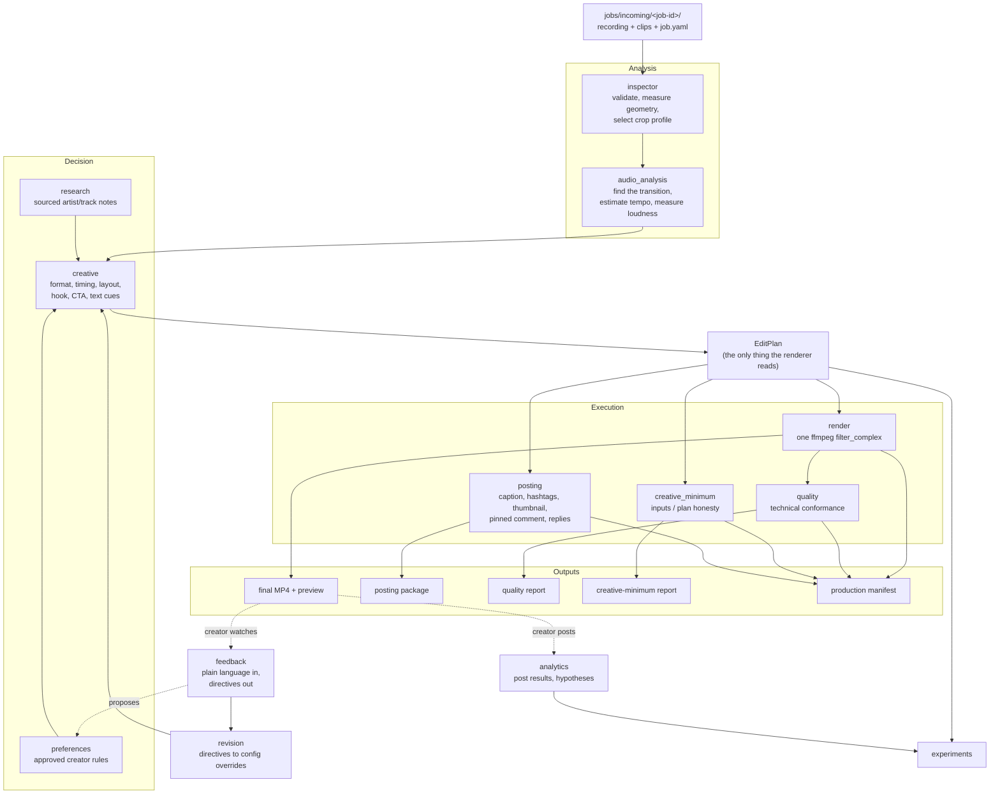

# Production pipeline architecture

How a Spotify screen recording becomes a post-ready TikTok video, and how the
creator's feedback changes what the next one looks like.

This is the design document for `production/`. For how to use it, start with
`docs/guides/setup.md`; for the day-to-day loop, `docs/guides/phone-workflow.md`.

## The shape of the problem

The pipeline is not a general video editor. It solves one narrow problem
repeatedly: a mix made inside Spotify, captured as a screen recording, has to
become a vertical video that a stranger will watch to the end. Almost everything
about the design follows from three facts about that problem.

**The audio is finished before the pipeline sees it.** The creator has already
made and checked the transition. The mix is the product. So audio is
pass-through, with loudness normalisation as the only permitted processing, and
nothing in the system is allowed to add a second sound source.

**The Spotify interface is the evidence.** The video's whole claim — that this
was made inside Spotify, from songs the viewer knows, and that they could do it
too — lives in the song labels and the waveform. So those regions are protected
in code: they cannot be cropped away, and text cannot be placed over them.

**Which creative choices work is unknown.** Hook wording, format family, text
style, CTA phrasing, how much secondary footage to show: none of this is settled.
So creative strategy is data, not code. Format families are YAML templates,
text styles are configuration, and every render can carry a hypothesis whose
result is recorded rather than assumed.

## Stage map



Each box is one module under `production/pipeline/`. The orchestrator
(`orchestrator.py`) is the only module that knows the order; the stages know
only their own inputs and outputs. `post_ready` requires both technical
conformance and creative minimum; neither gate claims For You performance.

## Why the EditPlan exists

Everything upstream of the renderer decides; the renderer only executes. That
separation is enforced by making the `EditPlan` the sole channel between them.
`render.py` reads no configuration, consults no preferences, and makes no
creative choice. Given a plan and an input report it produces the same frames
every time.

This buys three things. A plan can be reviewed, diffed or hand-edited without
running ffmpeg. A quality failure can be attributed to a decision rather than to
"the renderer". And two revisions can be compared field by field, which is how
the revision loop is verified in `examples/approved-outputs/job-001/`.

The plan is schema-checked (`schemas/edit-plan.schema.json`) in CI along with
every other artifact the pipeline writes.

## Hard rules versus experiments

The distinction is structural, not documentary.

**Hard rules live in `production/pipeline/rules.py`** as functions returning
violations, and are asserted again by `quality.py` against the finished file.
They are the things that must never vary:

- the Spotify recording's audio is the only audio, unaltered but for loudness
- song labels and the waveform are never cropped or covered
- one transition per video
- vertical 1080x1920 output inside the configured duration window
- original input files are never modified — proven by hashing them before and
  after every run
- no factual claim in the copy without a sourced, dated research note

A hard-rule violation fails the render. It is not a warning, and there is no
flag to skip it. The one deliberate exception is `layout.waveform_end_trim`,
which the creator sets explicitly to accept a cut into the waveform's ends in
exchange for a larger interface; even then it downgrades to a warning that names
the setting, rather than passing silently.

**Experimental rules live in `production/config/` and `production/templates/`.**
Hook wording, text animation, split proportions, cut frequency, hashtag mix,
thumbnail choice, how long secondary footage stays on screen. Changing any of
these is a configuration edit, not a code change, which is what makes them
cheap to test and cheap to revert.

## Format families as templates

A format family is a YAML file in `production/templates/` describing what the
family needs, where things go, and what it is expected to do for the viewer:

| Template | Layout | Needs a clip |
| --- | --- | --- |
| `clean-showcase` | full | no |
| `curiosity` | full | no |
| `comment-prompt` | full | no |
| `unexpected-combination` | full | no, but needs track metadata |
| `comedy-hook` | hook cutaway | yes |
| `ai-scene` | hook cutaway | yes |
| `split-screen` | split | yes |
| `picture-in-picture` | pip | yes |
| `reaction` | split | yes |

`creative.choose_format` scores them against the supplied assets, the job's mood
hint and approved preferences, and records why each rejected family lost. Two
kinds of rejection matter: a family can be refused for lacking the assets it
needs, or for making a claim the inputs cannot support — the
unexpected-combination hook asserts that two tracks clash, so it is refused
unless the job names genres that actually differ.

Adding a family means adding a template file. It does not mean touching the
renderer.

## Job lifecycle

```
jobs/incoming/<id>/  →  jobs/review/<id>/  →  jobs/approved/<id>/
                     ↘  stays in place with status needs_creative_input
                     ↘  jobs/failed/<id>/
```

A folder moves to `review` only when a render is **technically valid** and passes
**creative minimum** (track metadata or waiver, non-fallback format or forced/
waived, non-generic hook or waiver). Technical conformance alone is a draft —
`post_ready` stays false and the job is left in place with status
`needs_creative_input` and a creative-minimum report listing what to add.
Inspection or render failures move to `failed`. `./process-job approve <id>`
moves a review job on. Renders are written to `outputs/` keyed by job and
revision, so an approved job keeps every revision it went through.

The creator's media stays inside the job folder throughout and is never moved
out from under them, never renamed, and never written to.

## Feedback lifecycle

```
raw text  →  feedback/raw/<id>.txt          (verbatim, always)
          →  feedback/structured/<id>.yaml  (directives, each naming its trigger phrase)
          →  config overrides               (applied to this revision)
          →  preferences/proposed/<id>.yaml (a lasting rule, not yet in force)
          →  preferences/approved/<id>.yaml (only after explicit approval)
```

Interpretation is rule-based rather than model-based, which is a deliberate
trade. It cannot understand everything, but it can always explain itself: every
directive records the phrase that produced it, and anything not understood is
listed as an unmatched phrase rather than quietly dropped or guessed at.

Nothing promotes itself. A proposal becomes an approved preference when the
creator runs `prefs approve`, or when the same preference has been proposed from
three separate feedback events. Approving a preference that contradicts an
existing one supersedes it by link, and the superseded rule stays on disk.

## Experiment and analytics lifecycle

Every render may carry a hypothesis: what changed, why, which metric it targets,
what it is being compared against. The record starts at `awaiting_results`.

After posting, `./process-job analytics record` stores what the video actually
did. `analytics.report()` groups posts by format family, duration band, hook
type and hashtag strategy and offers comparisons — but only above a minimum
group size, always labelled with the number of posts behind them, and always
with `more_evidence_required` until several posts agree. One good video
concludes nothing, and the code says so rather than relying on the reader to
remember it.

## Rendering

One `ffmpeg` invocation per render, one `filter_complex` graph. Intermediate
files would cost a generation of quality and a class of sync bugs, so there are
none.

The graph is assembled in a fixed order: source split, blurred background,
Spotify surface fit and overlay, secondary clips, transition emphasis, progress
bar, text cues, output format. Audio is a separate one-line chain from input 0
and nothing else can reach it.

Two details are shaped by what FFmpeg 6.1 actually supports rather than by what
would be neatest. The transition zoom uses `zoompan`, because it is the only
filter in this build whose geometry can follow input time. The progress bar is
an `overlay` with a time-dependent `x`, because `drawbox` geometry is fixed when
the graph initialises.

### Fitting the Spotify surface

The hardest geometry problem is placing a capture into a placement of a
different shape without losing what must stay visible. `fit_spotify_surface`
handles two distinct cases:

- **Shape mismatch** (a split band, a landscape capture): crop around the
  envelope of every must-remain-visible region, grow that towards the
  placement's aspect using whatever margin the frame still has, and letterbox
  only if a mismatch survives.
- **Pure enlargement** (`spotify_content_zoom`, raised by "make the waveform
  larger"): crop towards the *hard* regions alone, so the album artwork is
  sacrificed before the labels or the waveform.

Enlargement has a physical ceiling worth understanding: the waveform already
spans most of the frame width, so it cannot grow far before its own ends are
cut. The fit computes that ceiling, reports how much enlargement was actually
achieved, and when the answer is "almost none" it says so and names the opt-in
setting that would go further. It does not pretend the request was satisfied.

## OpenMontage integration

OpenMontage is used where it owns a capability outright and is not reimplemented
where it does not (ADR 0001). It is a pinned external clone, never vendored,
because it is AGPL-3.0.

`om.py` is the adapter. Every capability it exposes has an FFmpeg fallback, so
the pipeline runs with or without the clone present and `./process-job status`
reports which backend each capability will use. This keeps a missing optional
dependency from being a hard failure on a phone-driven workflow.

## Storage

| Directory | Contents | In git |
| --- | --- | --- |
| `jobs/` | the creator's media and job config | no (state, and media never enters git) |
| `outputs/` | renders, plans, packages, quality reports | no (regenerated per run) |
| `feedback/`, `preferences/`, `experiments/`, `analytics/posts/` | the system's durable memory | yes |
| `examples/approved-outputs/` | worked examples as committed evidence | yes |
| `production/config/`, `production/templates/` | creative strategy | yes |
| `research/tracks/` | sourced artist and track notes | yes |

Media never enters git (`SECURITY.md`). Everything that shapes future renders
does, so the system's learning is reviewable in a diff.

## What is deliberately not here

- **No posting.** The pipeline produces a file and a package; the creator posts.
- **No Higgsfield or other generation calls.** The pipeline writes prompts for
  the creator to run; AI clips arrive as supplied assets.
- **No automated research retrieval.** Notes are added deliberately, with a URL
  and a date, and expire from "current" claims on their own.
- **No model in the loop at render time.** Given the same inputs and config, the
  same file comes out.
