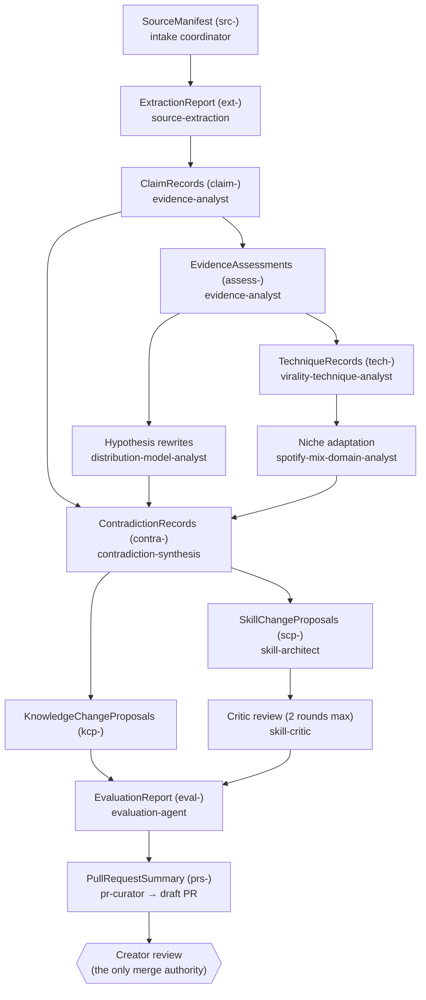

# Research-to-Skill Flow

Revision date: 2026-08-03. How one source becomes (at most) a small set of reviewed changes.
Executable form: `pipelines/research-ingestion.yaml` + `pipelines/skill-refinement.yaml`.

## Decision points that shape the output

1. **Claim identification** (evidence-analyst): only actionable, relevant claims become records;
   filler is dropped, but negative and counter-intuitive findings are kept.
2. **Mechanism rewriting** (distribution-model-analyst): "the algorithm favours X" claims become
   testable viewer-behaviour hypotheses or are marked untestable.
3. **Disposition** (virality-technique-analyst → skill-architect): each technique becomes
   knowledge_only / heuristic / production_skill / evaluation_criterion / experiment / rejected.
   The bar for `production_skill` is operationality: concrete trigger, steps, checkable output.
4. **Niche gate** (spotify-mix-domain-analyst): nothing reaches a proposal without a transfer
   judgement and a music-experience risk assessment.
5. **Contradiction check** (contradiction-synthesis): disagreements produce records and disputed
   statuses, never overwrites.
6. **Minimality** (skill-architect): the smallest correct change wins — usually a knowledge
   edit, rarely a new skill. No source rewrites every related skill.
7. **Critic + evaluation**: gate dimensions in `evaluation/rubrics/skill-quality.md` fail hard;
   regressions are recorded per `evaluation/README.md`.
8. **PR**: the creator sees findings, changes, contradictions, evaluation, recommendation, and
   every preserved disagreement — then decides.

## Where things live at each stage

| Stage output | Location |
|---|---|
| Working artifacts | `research/sources/<src-id>/` |
| Cross-source contradictions | `research/conflicts/` → standing ones promoted to `evidence/contradictions/` |
| Promoted claims/hypotheses | `evidence/claims/`, `evidence/hypotheses/` (moved by the PR branch) |
| Knowledge edits | `knowledge/**` (on the PR branch) |
| New candidate skills | `.cursor/skills/experimental/` |
| Evaluation outputs | `evaluation/reports/`, `evaluation/regression/` |
