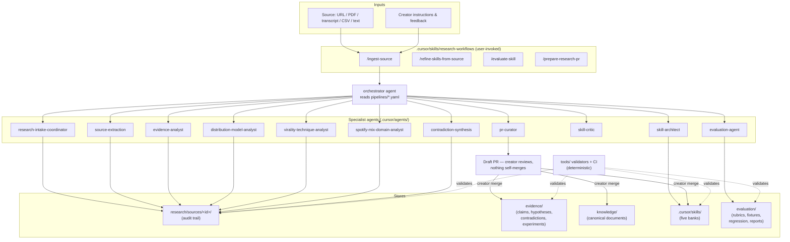

# System Overview

Revision date: 2026-08-03. The living architecture description (the phase-one proposal document
records what was approved; this reflects what exists).

## What exists today (phase 1)

Key properties:

- **Artifacts, not chat**: agents exchange schema-validated YAML (`schemas/`, ADR 0004).
- **PR gate**: `evidence/`, `knowledge/`, `.cursor/skills/` mutate only through reviewed PRs
  (ADR 0006).
- **Epistemic honesty end-to-end**: claim types, confidence bands, preserved contradictions
  (ADR 0003); the distribution model is descriptive, production rules are actionable
  (`CONTEXT.md`).
- **Deterministic CI / agent evaluation split**: CI never calls models; agent evaluations are
  committed reports.

## What is deliberately absent (future phases)

Production pipeline (phase 3+, via a pinned external OpenMontage clone — ADR 0001,
`future-video-pipeline.md`), analytics learning loop (phase 5 — ADR 0007), knowledge volume
(phase 2). Roadmap: `../roadmap/README.md`.

## Document map

| Question | Document |
|---|---|
| How does a source become a skill change? | `research-to-skill-flow.md` |
| Who decides what? | `agent-topology.md` |
| How is evidence structured? | `evidence-model.md` |
| How will OpenMontage be used? | `openmontage-integration.md` |
| What will production look like? | `future-video-pipeline.md` |
