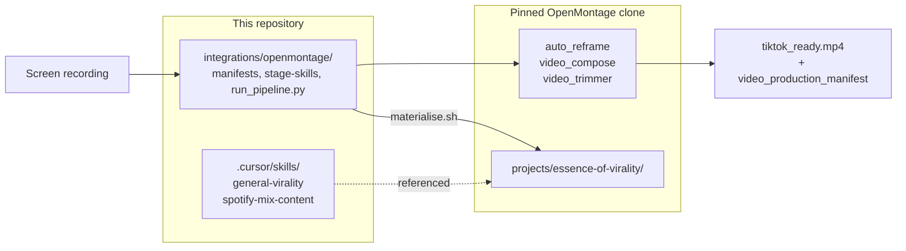

# OpenMontage pipeline — Spotify mix → TikTok

This guide gets you from a **Spotify mix screen recording** to a **TikTok-ready 1080×1920 MP4**, using OpenMontage tools and this repository's domain skills.

## What OpenMontage gives you

OpenMontage ([github.com/calesthio/OpenMontage](https://github.com/calesthio/OpenMontage)) is an agent-orchestrated video workbench (AGPL-3.0). We consume it as a **pinned clone** — no upstream code in this repo (ADR 0001).

| Capability | How we use it |
|---|---|
| `screen-demo` pipeline | Template for real screen captures → polished vertical demo |
| `tiktok` media profile | 1080×1920, 30 fps, H.264/AAC |
| `auto_reframe` | Landscape capture → 9:16 center crop |
| `video_trimmer` / `video_compose` | Trim + encode |
| Checkpoint + `final_review` | Audit trail (full agent path) |
| Project extensions | Our skills materialised under `projects/essence-of-virality/` |

OpenMontage does **not** post to TikTok — export is manual, matching our posting policy.

## Architecture



## Two ways to run

### A. Deterministic runner (start here)

No API keys. FFmpeg + OpenMontage Python tools only.

```bash
# One-time setup
git clone https://github.com/calesthio/OpenMontage.git integrations/openmontage/clone
cd integrations/openmontage/clone
git checkout $(grep -E '^[0-9a-f]{40}$' ../PINNED_REF | head -1)
make setup   # Python 3.10+, ffmpeg, npm for Remotion (optional for this path)

# Drop 1–2 screen recordings
cp ~/Movies/mix1.mp4 integrations/openmontage/inputs/
cp ~/Movies/mix2.mp4 integrations/openmontage/inputs/

# Run
python3 integrations/openmontage/run_pipeline.py --input-dir integrations/openmontage/inputs/
```

With blend window timestamps (feeds `evaluate-transition-payoff` checklist):

```bash
python3 integrations/openmontage/run_pipeline.py \
  video1.mp4 video2.mp4 \
  --blend-start 14 --blend-end 19
```

**Outputs** (per video, under `integrations/openmontage/outputs/<timestamp>/`):

| File | Purpose |
|---|---|
| `tiktok_ready.mp4` | Post-ready vertical export |
| `*-video_production_manifest.yaml` | Lineage artifact (links to skills + decisions) |
| `preserve-spotify-mix-audio.yaml` | Audio audit checklist |
| `analyse-first-frame.yaml` | First-frame review prompts |
| `evaluate-transition-payoff.yaml` | Payoff placement checklist |
| `first_frame.jpg` | Cover-frame reference |

Review the YAML checklists (or rerun stages with a Cursor agent using the skill bank) before posting.

### B. Full OpenMontage agent path (advanced)

For hooks, captions, overlays, and human gates across all seven `screen-demo` stages:

```bash
bash integrations/openmontage/materialise.sh
cd integrations/openmontage/clone
python -m backlot open essence-of-virality
```

Place source media at `projects/essence-of-virality/assets/video/`. Prompt the agent with the project skills in `projects/essence-of-virality/skills/` and the brief template at `artifacts/brief-template.json`.

## Domain skills wired in

| Skill | Role in pipeline |
|---|---|
| `preserve-spotify-mix-audio` | Blocks export if audio missing; no processing by default |
| `analyse-first-frame` | Checklist after export (agent completes) |
| `evaluate-hook-clarity` | Idea/assets stage (agent path) |
| `evaluate-transition-payoff` | Placement checklist with blend window |

Knowledge references: `knowledge/spotify-mix-niche/`, `knowledge/production-techniques/hooks.md`.

## Constraints (your style)

- 10–40 s, music-first, original captured audio
- No trending Sounds overlay
- Spotify UI legible at mobile size
- Structural edits only — never alter the blend audio
- Anonymous account; manual posting

## Troubleshooting

| Issue | Fix |
|---|---|
| Clone missing | See one-time setup above |
| Pin mismatch warning | `git -C integrations/openmontage/clone checkout $(grep … PINNED_REF)` |
| `auto_reframe failed` | Ensure `ffmpeg` is on PATH |
| Missing PyYAML | `pip install pyyaml` (repo `tools/requirements.txt` includes it) |
| Want captions/overlays | Use agent path with `render_runtime: remotion` in brief |

## Upgrading OpenMontage

Run `/review-openmontage-integration`, update `PINNED_REF`, re-run `materialise.sh`. Never copy upstream code into this repo.
